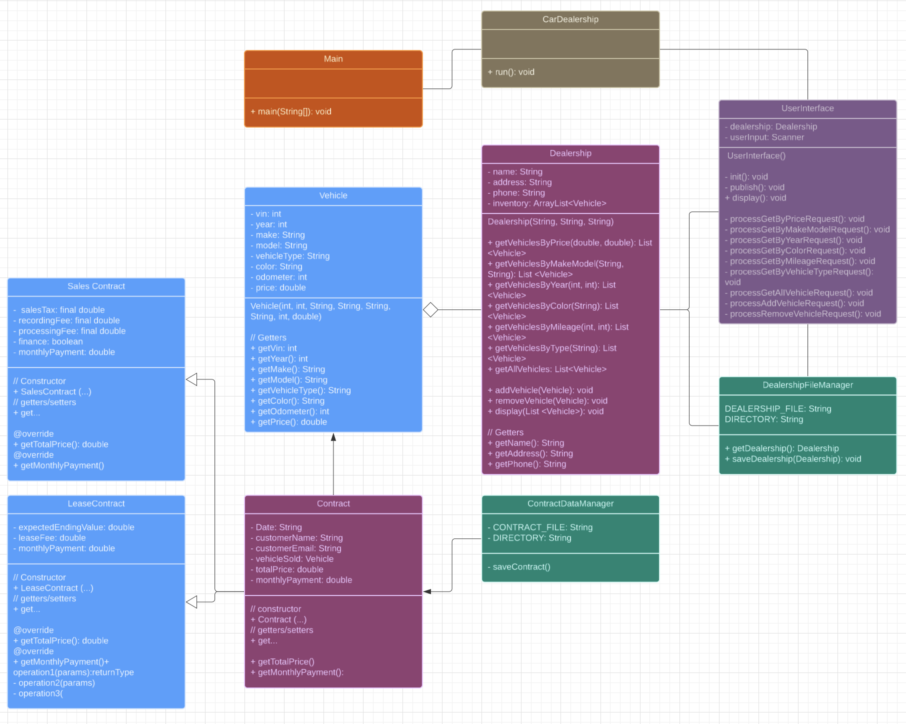

# Car Dealership Pair Project
Our Car Dealership Console App is a powerful tool designed for both customers and dealership staff. With an intuitive interface, users can search for their dream car based on specific criteria such as color, type, make, model, mileage, and price range. Whether you’re looking for a sleek sedan, a rugged SUV, a fuel-efficient hybrid, or a car made for jet setters and industry moguls- this app has you covered.

But that’s not all! The app also streamlines the buying process. Customers can choose to lease, finance, or purchase their selected vehicle. Contracts are generated seamlessly, ensuring transparency and convenience. Monthly payments and interest are readily available. Dealership staff can manage inventory, track sales, and assist customers efficiently. From browsing to signing the dotted line, our Car Dealership Console App makes the car-buying experience easier than blinking your eyes. 🚗💨

## UML


This is just an extended version of what we made from last week! Everything still works the same with additional features such as the usage of the abstract Contract class and 2 additional LeaseContract and Sales Contract

## Contract
The amazing thing with the abstract class was that it is used as a sort of template for our Lease Contract and Sales Contract. There are similarities
within these two but we do not want to call Contract specifically. 

### Example Code
```java
public abstract class Contract {
    String date;
    String customerName;
    String customerEmail;
    Vehicle vehicleSold;
    double totalPrice;
    double monthlyPayment;
    // <editor-fold desc=" Getters and Setters ">

    public Contract(String customerName, String customerEmail, Vehicle vehicleSold) {
        LocalDateTime now = LocalDateTime.now();
        DateTimeFormatter formatter = DateTimeFormatter.ofPattern("yyyy-MM-dd");
        this.date = now.format(formatter);
        this.customerName = customerName;
        this.customerEmail = customerEmail;
        this.vehicleSold = vehicleSold;
        this.totalPrice = vehicleSold.getPrice();

    }

    // [...]
    public abstract double getTotalPrice();

    public abstract double getMonthlyPayment();
    // [...]
}
```
Anything with the `abstract` tag cannot be called 
## Lease Contract
### Example Code
```java
public class LeaseContract extends Contract{

    double expectedEndingPrice;
    final double LEASE_FEE;
    
    public LeaseContract( String customerName, String customerEmail, Vehicle vehicleSold) {
        super(customerName, customerEmail, vehicleSold);
        this.expectedEndingPrice = super.totalPrice / 2;
        this.LEASE_FEE = super.totalPrice * 0.07;
    }

    @Override
    public double getTotalPrice() {
        double LEASE_TERM_TOTAL = this.getMonthlyPayment() * 36;
        return LEASE_TERM_TOTAL + LEASE_FEE;
    }

    @Override
    public double getMonthlyPayment() {
        final double RATE = 0.04;
        final double MONTHS = 36;
        final double PRICE = super.totalPrice;
        return emi_calculator(PRICE, RATE, MONTHS);
    }
}
```
`super` function is used to construct the super/parent class and the `abstract` methods are overridden so they can be called properly
based on the functionality 

### Example Outcome

## Sales Contract
### Example Code
```java
public class SalesContract extends Contract {
    private final double SALES_TAX;
    private final double RECORDING_FEE;
    private final double PROCESSING_FEE; // 295 for under 10k
    private boolean finance;

    public SalesContract(String customerName, String customerEmail, Vehicle vehicleSold, boolean finance) {
        super(customerName, customerEmail, vehicleSold);
        this.SALES_TAX = 0.05 * totalPrice;
        this.RECORDING_FEE = 100;
        this.PROCESSING_FEE = vehicleSold.getPrice() > 10000 ? 495 : 295;
        this.finance = finance;
    }

    @Override
    public double getMonthlyPayment() {
        final double BELOW_10K_RATE = 0.0525;
        final double ABOVE_10K_RATE = 0.0425;
        final double BELOW_10K = 24;
        final double ABOVE_10K = 48;
        final double PRICE = super.totalPrice;
        final double FEES = RECORDING_FEE + SALES_TAX + PROCESSING_FEE;

        return isFinance() ? (PRICE > 10000 ? emi_calculator(PRICE, ABOVE_10K_RATE, ABOVE_10K) : emi_calculator(PRICE, BELOW_10K_RATE, BELOW_10K)) : (PRICE + FEES);
    }
    @Override
    public double getTotalPrice() {
        final double BELOW_10K = 24;
        final double ABOVE_10K = 48;
        final double PRICE = super.totalPrice;
        final double FEES = RECORDING_FEE + SALES_TAX + PROCESSING_FEE;

        return isFinance() ? (PRICE > 10000 ? (this.getMonthlyPayment() * ABOVE_10K) + FEES : (this.getMonthlyPayment() * BELOW_10K) + FEES) : (PRICE + FEES);
    }
}
```
Exactly just like LeaseContract `super` function is used to construct the super/parent class and the `abstract` methods are overridden so they can be called properly
based on the functionality.

### Example Outcome

## Pros and Cons
> Pros: 
> 1. We were able to get the job done effiently
> 2. We were able to make comments on each other's code in real time
> 3. We can see two different perspectives of problem solving
> 
> Cons:
> 1. We were collaborating incorrectly at first but we ended up switching it up and working WITH each other
> 2. There were times we had git issues: merge conflicts.